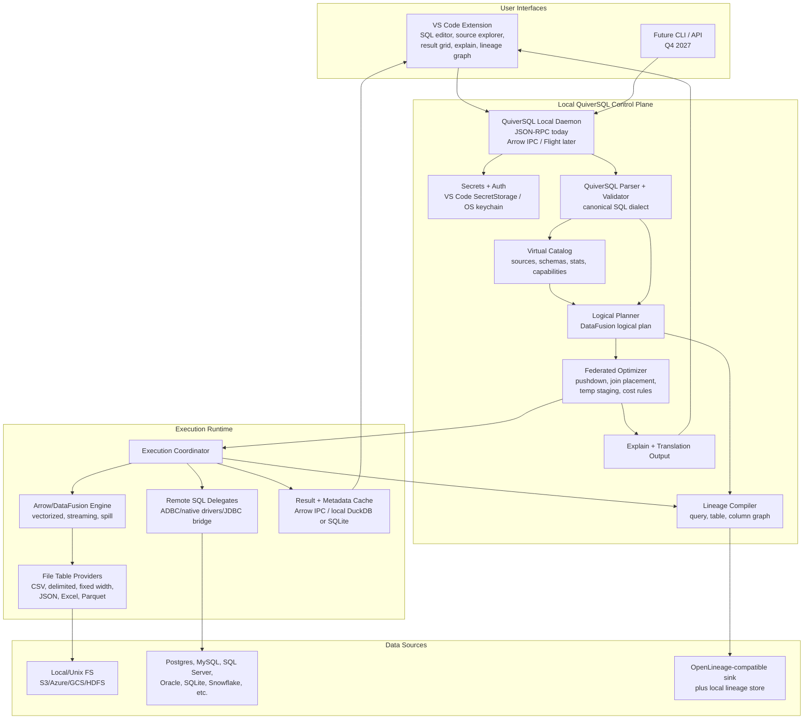

# QuiverSQL

**Current version:** `0.1.1-alpha.0`<br>
**Release status:** alpha prototype

QuiverSQL is a developer-first, Arrow-native query virtualization layer: lighter than Dremio, Denodo, Trino, and Starburst; broader than DuckDB or Apache DataFusion alone; and focused first on interactive SQL over files plus heterogeneous databases from VS Code.

The project is currently an alpha prototype. The intended product direction is a Q3 2026 interactive launch for the VSIX and translation engine, followed by API and CLI hardening toward Q4 2027.

QuiverSQL is local-first today: a TypeScript VS Code extension talks to a Rust daemon over JSON-RPC, the daemon embeds DataFusion, and results move through Arrow/DataFusion into a VS Code result grid. This repository is not production ready yet, but it now contains the core shape of the original architecture: local SQL execution, file-backed virtual tables, SQLite federation, basic explain output, and basic lineage.

## Product Thesis

Current data workflows often force developers to convert files to Parquet, register external tables, use a heavier federated engine, materialize cross-source joins into staging tables, then inspect lineage afterward. QuiverSQL's opening is to make that flow interactive, local-first, and source-aware.

QuiverSQL is meant to sit between these existing solutions:

| Area | Existing Workaround | QuiverSQL Direction |
| --- | --- | --- |
| SQL over local files | DuckDB is excellent for CSV, JSON, Parquet, Excel, cloud/object storage, and local analytics. | Keep the file-query ergonomics, but add source-aware VS Code workflows, lineage, and federation. |
| Rust-native query execution | Apache DataFusion provides Arrow-native SQL/DataFrame execution and extensibility. | Use DataFusion as the execution foundation, while adding product UX, connectors, catalog, and planner behavior. |
| Federated SQL | Trino and Starburst solve large-scale federation with catalogs and connectors. | Offer a lighter local developer tool before cluster operations are needed. |
| Enterprise virtualization | Dremio and Denodo provide governance, caching, catalogs, and enterprise federation. | Stay smaller, embedded, open, and developer-first. |
| Cloud external queries | Athena, BigQuery, Snowflake, and Databricks reduce ETL inside cloud ecosystems. | Avoid cloud lock-in and fragmented SQL by making local interactive workflows pleasant first. |
| Translation and lineage components | SQLGlot, ADBC, Substrait, OpenLineage, and Marquez solve pieces of the stack. | Integrate translation, execution, explain, and lineage into one VS Code-centered workflow over time. |

## Target Architecture



The repository implements the early VSIX plus local daemon slice of this diagram. Many control-plane and optimizer components are still planned.

## Support Checklist

### Data Sources Supported

- [x] CSV
- [x] Parquet
- [x] NDJSON / newline-delimited JSON
- [x] SQLite
- [ ] Excel `.xlsx`
- [ ] Fixed-width files
- [ ] Postgres
- [ ] MySQL / MariaDB
- [ ] SQL Server
- [ ] Oracle
- [ ] Snowflake
- [ ] S3 / Azure Blob / GCS / HDFS object or distributed storage

### Features Supported

- [x] VS Code extension
- [x] Local Rust daemon
- [x] JSON-RPC over stdio
- [x] DataFusion-backed SQL execution
- [x] Attach local files as virtual tables
- [x] Attach SQLite tables as virtual tables
- [x] Query editor command and CodeLens run action
- [x] JSON result delivery
- [x] VS Code result grid
- [x] Basic DataFusion `EXPLAIN`
- [x] Basic table/column lineage from resolved logical plans
- [x] Basic joins across registered file and SQLite tables
- [x] Quickstart sample data
- [ ] Persisted virtual catalog
- [ ] Source profiles with capability metadata
- [ ] VS Code SecretStorage / OS keychain integration
- [ ] Predicate pushdown
- [ ] Projection pushdown
- [ ] Limit pushdown
- [ ] Aggregate pushdown
- [ ] Cost-aware federated optimizer
- [ ] Join placement strategy
- [ ] Temp-table or broadcast strategy for cross-source joins
- [ ] Connector-specific SQL translation output
- [ ] OpenLineage-compatible run events
- [ ] Paged/streaming result grid
- [ ] Query cancellation and timeouts
- [ ] Public CLI
- [ ] Public API
- [ ] Packaged VSIX and daemon installers

### Detailed Status

| Capability | Status | Notes |
| --- | --- | --- |
| VS Code extension | Supported now | QuiverSQL Explorer, SQL command, CodeLens, result grid, explain panel, lineage tree. |
| Local daemon | Supported now | JSON-RPC over stdio. Arrow IPC/Flight is planned. |
| DataFusion execution | Supported now | DataFusion is the current Rust-native execution engine. |
| CSV files | Supported now | Registered as virtual tables through DataFusion. |
| Parquet files | Supported now | Registered as virtual tables through DataFusion. |
| NDJSON / JSON files | Supported now | Uses DataFusion's NDJSON reader. `.json` samples are newline-delimited JSON. |
| SQLite tables | Supported now | SQLite tables can be registered through a DataFusion `TableProvider`. |
| Quickstart sample data | Supported now | CSV, NDJSON, JSON, Parquet, and SQLite samples live in `samples/quickstart/`. |
| Federated joins | Partial | Local DataFusion can join registered file and SQLite tables, but remote pushdown and join placement are early. |
| Explain plan | Partial | DataFusion `EXPLAIN` output is available; connector translation explain is planned. |
| Lineage | Partial | Basic table/column lineage from resolved logical plans exists; OpenLineage-compatible events are planned. |
| Daemon discovery | Partial | `qsql.daemonPath` is configurable; packaged binaries and installers are planned. |
| Result grid | Partial | Current grid renders JSON rows; paging, cancellation, and streaming UX are planned. |
| Excel `.xlsx` | Planned | Part of the original file-provider goal. |
| Fixed-width files | Planned | Expected to require explicit schema/layout files first. |
| Postgres connector | Planned | First likely network RDBMS connector after SQLite hardening. |
| MySQL / MariaDB connector | Planned | Connector trait and SQL emitter work needed first. |
| SQL Server connector | Planned | Connector trait and SQL emitter work needed first. |
| Projection/filter/limit pushdown | Planned | Needed to make federation efficient and explainable. |
| Aggregate pushdown and join placement | Planned | Needed for serious cross-source federation. |
| Temp-table or broadcast join strategy | Planned | Needed for larger cross-source joins. |
| Persisted virtual catalog | Planned | Source profiles, schemas, stats, and capabilities are not persisted yet. |
| Secrets and auth storage | Planned | VS Code SecretStorage / OS keychain integration is planned. |
| OpenLineage events | Planned | QuiverSQL-specific logical lineage exists first; OpenLineage sink comes later. |
| Public CLI / API | Planned | Designed early, hardened toward Q4 2027. |
| Marketplace VSIX / installers | Not started | The repo is currently source-first for contributors. |

## Current Repository Progress

The current implementation maps to the first alpha slice of the original delivery plan:

- `qsql-core`: DataFusion session, SQL execution, JSON/string result conversion, file registration, table-provider registration, and basic lineage.
- `qsql-connectors`: SQLite connector plus DataFusion table provider; connector trait for future sources.
- `qsql-daemon`: stdio JSON-RPC daemon with `ping`, `execute`, `execute_json`, `register_file`, `register_sqlite`, and `get_lineage`.
- `qsql-vscode`: VS Code extension with data-source explorer, connect wizard, query execution, result grid, explain panel, and lineage tree.
- `samples/quickstart`: fictional, committed sample data across the formats currently supported.

## Quickstart

### Prerequisites

- Rust toolchain with Cargo
- Node.js 18 or newer
- VS Code 1.85 or newer

### Build The Daemon

```powershell
cd qsql-workspace
cargo build -p qsql-daemon
```

The debug daemon will be written to:

```text
qsql-workspace/target/debug/qsql-daemon.exe
```

On macOS/Linux the binary name is `qsql-daemon`.

### Build The Extension

```powershell
cd qsql-vscode
npm ci
npm run compile
```

Open this repository in VS Code, press `F5`, and launch the extension host.

If the extension cannot find the daemon automatically, set `qsql.daemonPath` in VS Code settings to the absolute path of the daemon binary.

### Try The Sample Data

The quickstart samples live in `samples/quickstart/` and include:

- `employees.csv`
- `departments.ndjson`
- `projects.json` as newline-delimited JSON
- `orders.parquet`
- `demo.sqlite`

From the QuiverSQL Explorer, use **QuiverSQL: Connect Data Source** to attach the sample files and tables. Suggested aliases:

```text
employees      samples/quickstart/employees.csv
departments    samples/quickstart/departments.ndjson
projects       samples/quickstart/projects.json
orders         samples/quickstart/orders.parquet
compensation   samples/quickstart/demo.sqlite table: compensation
offices        samples/quickstart/demo.sqlite table: offices
```

Then run:

```sql
SELECT name, role, salary
FROM employees
WHERE salary > 90000
ORDER BY salary DESC;
```

```sql
SELECT e.name, e.role, c.bonus, c.review_score
FROM employees e
JOIN compensation c ON e.id = c.employee_id
ORDER BY c.review_score DESC;
```

```sql
SELECT e.name, o.product, o.amount
FROM employees e
JOIN orders o ON e.id = o.employee_id
WHERE o.shipped = true
ORDER BY o.amount DESC;
```

### Regenerate Samples

The committed sample files are small, fictional, and safe to keep in the repository. To regenerate them:

```powershell
cd qsql-workspace
cargo run -p qsql-connectors --example generate_quickstart_samples
```

## Development Commands

Rust:

```powershell
cd qsql-workspace
cargo fmt --all -- --check
cargo clippy --locked --workspace --all-targets -- -D warnings
cargo test --locked --workspace
```

VS Code extension:

```powershell
cd qsql-vscode
npm ci
npm run typecheck
npm run lint
npm run test:scanner
```

## Versioning

QuiverSQL uses SemVer. The current alpha version is recorded in:

- `VERSION`
- `qsql-workspace/*/Cargo.toml`
- `qsql-vscode/package.json`
- `qsql-vscode/package-lock.json`
- `CHANGELOG.md`

During the alpha period, versions use prerelease labels such as `0.1.0-alpha.0`. Breaking changes can still happen before the first stable release, but version bumps should still describe the user-visible change clearly in the changelog.

The daemon exposes a JSON-RPC `version` method with product, daemon, core, connector, and RPC protocol versions. The VS Code extension also includes `QuiverSQL: Show Version`, which displays the extension version and daemon component versions when the daemon is available.

## Roadmap

| Phase | Goal | Major Work |
| --- | --- | --- |
| Phase 0 | GitHub-ready alpha | Open-source docs, Apache-2.0 license, CI, samples, formatting, linting, reproducible setup. |
| Phase 1 | Stabilize MVP contracts | `SourceProfile`, `TableRef`, daemon RPC schema, VS Code settings, result/error envelope. |
| Phase 2 | Make federation honest | Projection/filter/limit pushdown, connector capabilities, Postgres connector, better explain output. |
| Phase 3 | Improve UX depth | Persistent profiles, paged results, safer webview rendering, cancellation, richer lineage. |
| Phase 4 | Resume original architecture goals | Excel/fixed-width providers, OpenLineage events, temp/broadcast joins, installers, future CLI/API. |

## Contributing

QuiverSQL welcomes issues, docs improvements, tests, connector work, VS Code UX improvements, sample data improvements, and code review. For small documentation fixes, a direct pull request is fine. For larger features, connector work, daemon RPC changes, or public behavior changes, open an issue first so the design can be discussed before implementation.

High-level flow:

1. Fork and clone the repository.
2. Create a focused branch for one bug, feature, or docs change.
3. Build the daemon and extension locally.
4. Run the quickstart samples or a relevant manual smoke test.
5. Run the required Rust and TypeScript checks.
6. Open a pull request with a clear summary, test results, and any known limitations.

The detailed contributor workflow is in [CONTRIBUTING.md](CONTRIBUTING.md).

## License

Licensed under the Apache License, Version 2.0. See [LICENSE](LICENSE).
